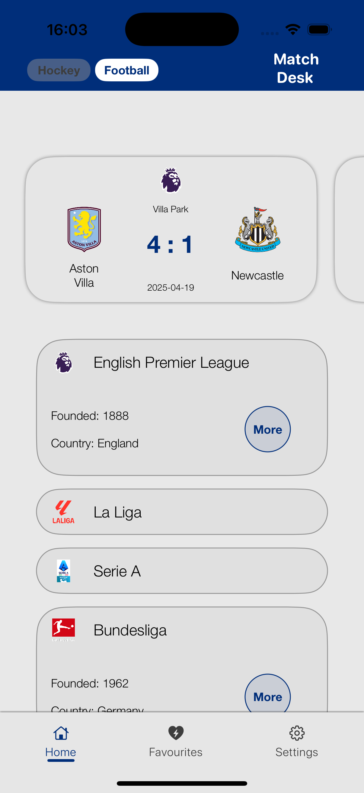
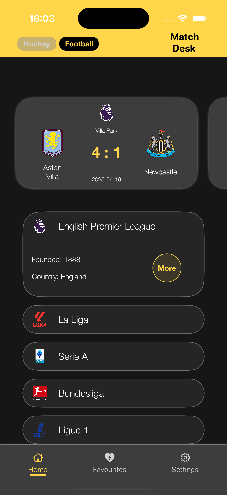
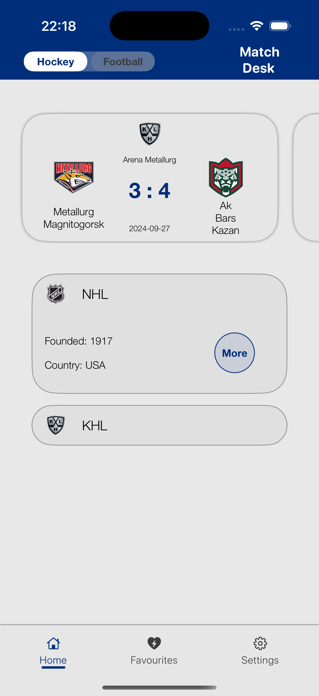
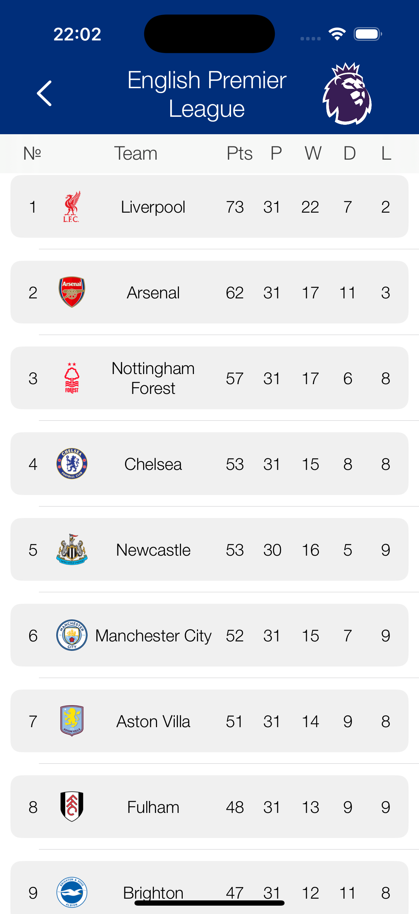
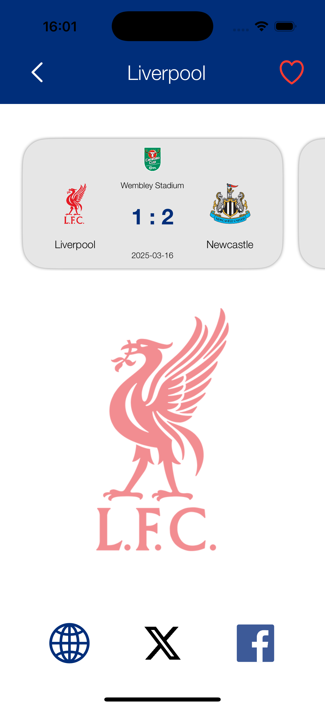
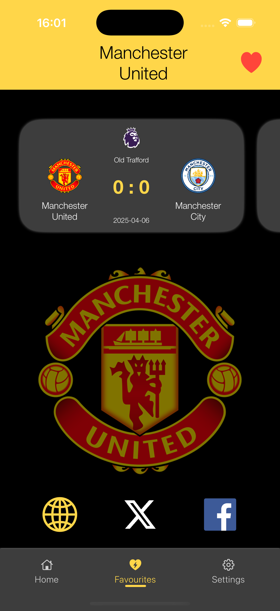

# ⚽ MatchDesk — iOS SwiftUI pet-project

### 👋 Welcome
This is my  pet-project built with SwiftUI. It serves for displaying basic info and statistics for football and hockey leagues.

## 📌 Project Overview
The app ought to include:
- A main screen to select a league by sport
- A league screen with standings
- A team screen with brief team info and match history
- API integration and data parsing
- UI built with SwiftUI using MVVM pattern

## ✅ Completed
- JSON models for league and team data
- API fetching and parsing
- Custom navigation bar (BottomNavBar)
- TabView with dynamic content switching
- Scrollable UI for matches and leagues
- Standings view for each league 
- Color theming
- League standings table
- Team detail screen

## 🔜 In Progress / To Do
- Caching mechanism
- Onboarding screen and loaders
- Hockey teams view

## ⚠️ Known Issues / Challenges
- Color theme has to be reworked

## 📸 Current UI

### Main Screen (Light Mode)

### Main Screen (Dark Mode)

### Main Screen (Hockey)

### Standings View

### Team Detail View

### Favourite Team View

### Settings View

## 🛠 Stack
- Swift
- SwiftUI
- Xcode
- GitHub
- TheSportsDB.com API

## 👤 Author
Danila Avdienko
